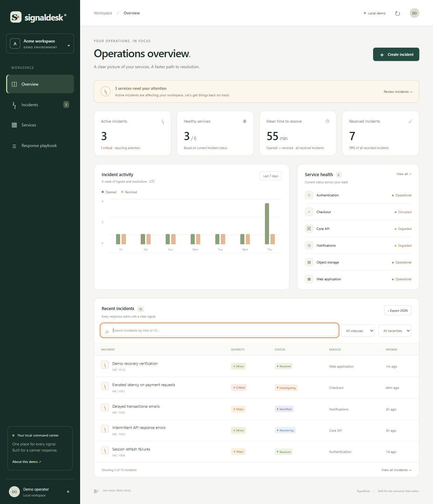
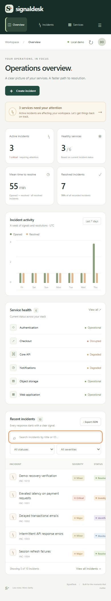

# SignalDesk

**Less noise. More clarity.** A local incident operations console that turns an operational signal into a documented response.


[Quick start](#quick-start) · [Architecture](docs/architecture.md) · [API](docs/api.md) · [Guia para apresentação em português](docs/apresentacao.md)



## The problem

During an incident, the important information is often scattered: what broke, which service is affected, what has been tried, and whether recovery is real. SignalDesk brings those answers into one small, auditable workflow.

This is a **working portfolio application**, with a real HTTP API and SQLite persistence. The initial incidents are explicitly fictional. It does not claim to monitor live infrastructure.

## What works

- **Operations overview:** active and critical incidents, healthy services, mean resolution time, and a seven-day activity chart.
- **Incident workflow:** create, investigate, identify, monitor, resolve, and reopen incidents with server-enforced transitions.
- **Activity timeline:** persist response notes and every status change alongside the incident.
- **Service health:** derive operational, degraded, or disrupted status from active incidents.
- **Search and filters:** combine title/ID search, severity, status and service filters; export matching incident summaries as JSON.
- **Response playbook:** a concise guide for conducting and explaining an incident response.
- **Responsive interface:** desktop sidebar, compact mobile navigation, native dialogs, labelled controls, visible focus and empty/error states.
- **Local persistence:** restarting the app preserves incidents and their history.

## Quick start

Requires **Node.js 24 or newer**. There are no third-party dependencies and no install step.

```sh
git clone https://github.com/wellemlyra/signaldesk.git
cd signaldesk
npm start
```

Open **http://127.0.0.1:4310**.

On first run, the app creates `data/signaldesk.sqlite` and inserts nine sample incidents across six services. Subsequent runs keep existing data. The `data/` folder is excluded from version control.

```sh
npm run dev    # Restart automatically when server files change
npm run check  # Check JavaScript syntax
npm test       # Run domain and HTTP integration tests
```

The browser needs a refresh after frontend changes. To use a different port, set `PORT` before starting; on PowerShell: `$env:PORT = '4311'; npm start`.

To begin with no sample incidents, set `SEED_DEMO=false` **before the first run**. In PowerShell: `$env:SEED_DEMO = 'false'; npm start`. This does not remove incidents from an existing database.

## A three-minute walkthrough

1. Open **Overview** and identify the service marked disrupted.
2. Create an incident with a title, affected service, severity and impact description.
3. Add an update and move the incident from **Investigating → Identified → Monitoring → Resolved**.
4. Watch the activity timeline, service health and metrics update.
5. Reopen the incident and see its service become affected again.
6. Search the incident workspace and export the matching summaries.
7. Restart the server to demonstrate that the timeline is persisted.

## Engineering decisions

| Decision | Why | Trade-off |
| --- | --- | --- |
| Node's built-in HTTP server and SQLite driver | A reviewer can run the complete app without installing packages | HTTP routing and validation are explicit application code |
| SQLite transactions | Status and timeline updates either both succeed or both roll back | The synchronous driver targets small local workloads |
| Explicit incident state machine | Prevent invalid transitions and make reopening intentional | Production workflows may require more statuses and permissions |
| Derive health from incidents | Keep service health consistent with the recorded response | This is incident-derived health, not independent monitoring |
| Native browser modules | Small, directly readable frontend with no build pipeline | The view layer is intentionally simple, not a large-app component system |
| Loopback-only server | A self-contained single-operator demo | Public deployment requires authentication and further hardening |

See the [architecture notes](docs/architecture.md) for data modeling, failure handling, metrics definitions and extension points.

## Verification

`npm test` covers eight automated scenarios: the full lifecycle and metrics, invalid-transition rollback, reopening, malformed input, combined filters and SQL metacharacters, multiple incidents affecting one service, restart persistence, and HTTP behavior including origin/content/body-size checks.

The UI has also been manually exercised in a browser for incident creation, status progression, timeline updates and empty search results. A 390px mobile viewport was checked for page overflow; wide tables scroll inside their panel. These manual checks are separate from the automated test suite.

<details>
<summary>Mobile screenshot</summary>



</details>

## Scope and limitations

- Single operator and local use; there is **no authentication, authorization or tenant isolation**.
- No real monitoring, alert delivery, billing, external integrations or background polling.
- The timeline is an application audit trail, not a tamper-proof compliance log.
- Export includes incident summaries; it does not include the timeline.
- No incident deletion UI, service editor, pagination, schema-upgrade framework or production deployment configuration.
- Mean resolution time uses each currently resolved incident's original opening time and latest resolution time. Reopening removes it from the metric until it is resolved again.
- Do not expose this server directly to the internet. Public hosting would require a different deployment design.

Next steps would be authenticated responders, ownership and escalation, pagination, migration tooling, and a reproducible browser test suite. These are future work, not implemented features.

## Development note

Built with AI-assisted implementation and review. The repository documents the behavior and trade-offs so they can be inspected, tested and discussed directly; it does not represent production deployment experience.

## License

[MIT](LICENSE).

