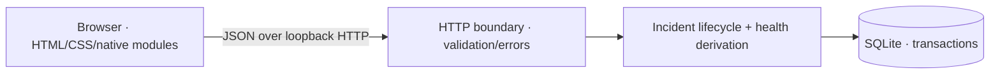
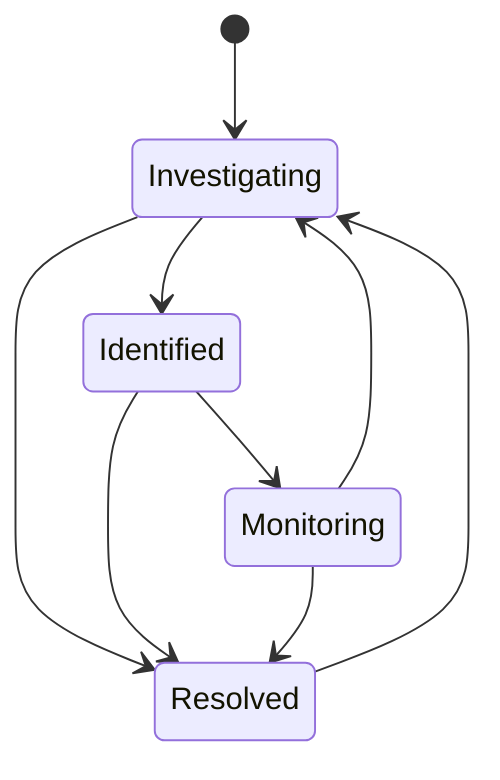

# Architecture

SignalDesk is a single-process, local-first application. It has three boundaries:

## Repository map

- `src/server.js`: HTTP routes, request limits, origin checks, response headers and static asset allowlist.
- `src/store.js`: relational schema, validation, incident lifecycle, atomic writes, metrics and sample seed.
- `public/`: semantic HTML, responsive CSS and a native-module frontend.
- `test/app.test.js`: domain tests, a real file-backed persistence test and HTTP integration tests.
- `docs/`: API reference, design notes, screenshots and a presentation guide.

## Data model

`services` contains the six demo services. `incidents` references one service and has a stable UUID, sequential human-readable number, severity, lifecycle status and timestamps. `events` references an incident and records creation, transitions and notes.

Foreign keys and status/severity checks protect database integrity. A composite event index supports timeline reads. Each create/update executes inside `BEGIN IMMEDIATE` / `COMMIT`, with rollback on failure, so an incident cannot change status without its corresponding timeline record.

The local database uses WAL mode. A schema version is recorded, but incremental migrations are not yet implemented. The first-release schema uses `CREATE TABLE IF NOT EXISTS`; future schema changes need a real migration strategy.

## Lifecycle

Direct resolution allows a transient or quickly mitigated issue to be closed without inventing intermediate work. Monitoring can fall back to investigation; resolved incidents can reopen. Notes do not require a status change. A status-only no-op is rejected.

On reopening, `resolved_at` becomes null. On a later resolution, it receives a new timestamp. Earlier transitions remain in the timeline. There is no optimistic-concurrency control because this is a single-operator demo; multi-user evolution should add a version check and conflict handling.

## Derived data

- **Disrupted service:** at least one unresolved critical incident.
- **Degraded service:** other unresolved incidents, with no unresolved critical incident.
- **Operational service:** no unresolved incidents.
- **MTTR:** mean elapsed minutes from original `created_at` to current `resolved_at`, considering only currently resolved incidents. The UI rounds to whole minutes.
- **Resolved percentage:** currently resolved / all recorded incidents.
- **Seven-day chart:** incident openings and current resolution timestamps bucketed by UTC calendar day. Reopening removes the previous resolution from this chart; it is not an immutable count of all past resolution events. Individual timeline timestamps display in the browser's local timezone.

There are no fabricated uptime percentages or external monitoring claims. Sample incidents are explicitly labeled as demo data.

## HTTP and UI boundaries

Requests use JSON objects. Titles, descriptions, notes, service IDs, severity and transitions are validated server-side. Parameterized statements isolate user input from SQL. Request bodies are limited to 16 KB and decoded after assembling byte chunks to preserve UTF-8 characters.

Only a fixed set of static asset paths is served. Browser-facing responses include a restrictive content policy, `nosniff`, and a no-referrer policy. Cross-origin writes and unexpected Host headers are rejected. These measures do not replace authentication; the app intentionally binds only to `127.0.0.1`.

Frontend user text is escaped before template insertion. Mutations disable their submit button while in flight, show validation failures inside the dialog, and reload derived data after success. Native dialogs support Escape and focus containment. Filter changes update table rows without replacing the focused search field.

## Scaling and deployment trade-offs

Synchronous SQLite keeps the demo understandable but blocks the event loop during database work. Lists and aggregates are calculated in memory and return all rows. This is suitable for reviewing a small portfolio application, not a high-volume operations platform.

Before offering a shared service: add authentication and authorization; define tenant boundaries; migrate to an appropriate storage and connection model; add pagination and indexed aggregation; implement migrations, backups and recovery; add optimistic concurrency and idempotency for writes; configure TLS, rate limits and observability; then expand tests to concurrency, access control and browser regression coverage.
